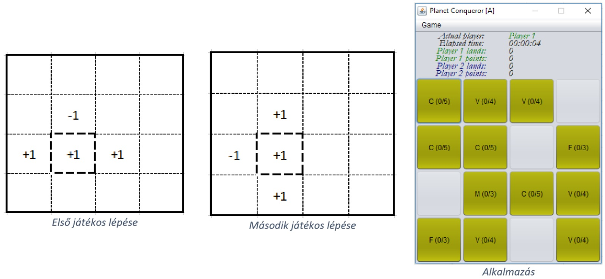

# 1. rész (ELÉGSÉGES): 

A játékkal alapértelmezetten egy 4x4-es táblán játszanak, melynek minden cellájában egy gomb található. A gombok elfoglalható, vagy elfoglalhatatlan területeknek felelnek meg. A tábla minden sorában található egy elfoglalhatatlan terület (szakadék), melyet véletlenszerűen választunk meg.   Két féle elfoglalható terület van: az utak (PATH) 15 pontot érnek és 2. kísérletre lehet elfoglalni őket, a városok (CITY) pedig 100 pontot érnek és 5. kísérletre lehet elfoglalni őket. A játéktér többi részét véletlenszerűen töltsük fel ilyen elfoglalható területekkel. Ezeket kezdetben sárga színnel és a terület típus + aktuális kísérletek száma + elfoglaláshoz szükséges próbálkozások számát (ellenállás) tartalmazó szöveggel jelenítsük meg. (Például út esetén: P (0/2), város esetén: C (0/5).)  

A játékban a két játékos különböző logika mentén foglal területeket. Mindkét játékosra igaz, hogy a kijelölt terület elfoglalási kísérleteinek számát növeli 1-gyel, amennyiben az még nem tartozik senkihez. Az első játékos növeli 1-gyel a kattintás helyétől balra és jobbra található terület elfoglalási kísérleteinek számát is, viszont csökkenti 1-gyel a kattintás helye felett találhatóét.   A második játékos növeli 1-gyel a kattintás helye felett és alatt található terület elfoglalási kísérleteinek számát, viszont csökkenti a balra találhatóét 1-gyel.  Ha valamelyik szabály olyan területet érint, ami már birtokban van, úgy az adott szabály nem érvényesül. Egy játékos akkor foglal el egy terület, amikor az adott területhez tartozó próbálkozások száma eléri a terület ellenállásának értékét. Az elfoglalt mező színe a játékos színére változik, mely az első játékos eseténél zöld, a második játékos eseténél kék. Ilyenkor a megjelenítendő szövegben csak a terület típusának első karaktere marad meg (P vagy C).  A próbálkozások száma a negatív módosítások miatt sem mehet 0 alá!  Jelezzük mindig az aktuális játékost egy címkében a sorszámával és a színével. (Például Player 1 zöld színnel.) Az a játékos nyer, aki a legtöbb pontot tudja megszerezni.

# 2. rész (KÖZEPES):  

Készíts egy menüt, melynek a segítségével új játékot tudunk indítani, és legyen lehetőségünk a játékot 6x8as táblán is játszani.   Amennyiben nem így készítetted volna el az első részben a játék végének a megállapítását, úgy a játék abban a pillanatban érjen véget, amikor az egyik játékos legalább a megszerezhető pontok felénél eggyel többet birtokol. A játék végénél jelenjen meg egy felugró üzenet, melyben gratulálunk a nyertes játékosnak. Az elfoglalható területek típusát bővítsd ki az alábbiakkal: 
 --  rét (MEADOW) – 40 pontot ér és 3 az ellenállása 
 -- erdő (FOREST) – 50 pontot ér és 3 az ellenállása 
 -- falu (VILLAGE) – 75 pontot ér és 4 az ellenállása 

# 3. rész (JÓ): 
Az alkalmazást az MV architektúrának megfelelően implementáld. 

# 4. rész (JELES): 
Készíts egy időzítőt, mely alapján tájékozódhatnak a játékosok, hogy mennyi idő telt el az aktuális játék kezdete óta. Abban az esetben, ha az egyik játékos megnyerte az aktuális játékot az időzítőt le kell állítani. Az időzítő mellett jelezzük a játékosok által elfoglalt területek számát és az aktuálisan megszerzett pontokat. Ehhez színezzük be a szükséges mezőket a játékos színével. A játékba vezessük be azt a szabályt, hogy amennyiben az aktuális játékos a kijelölt területet (amire kattintott) elfoglalja, úgy ismételten ő foglalhat területet.   

### JÓ MUNKÁT KÍVÁNUNK! 
